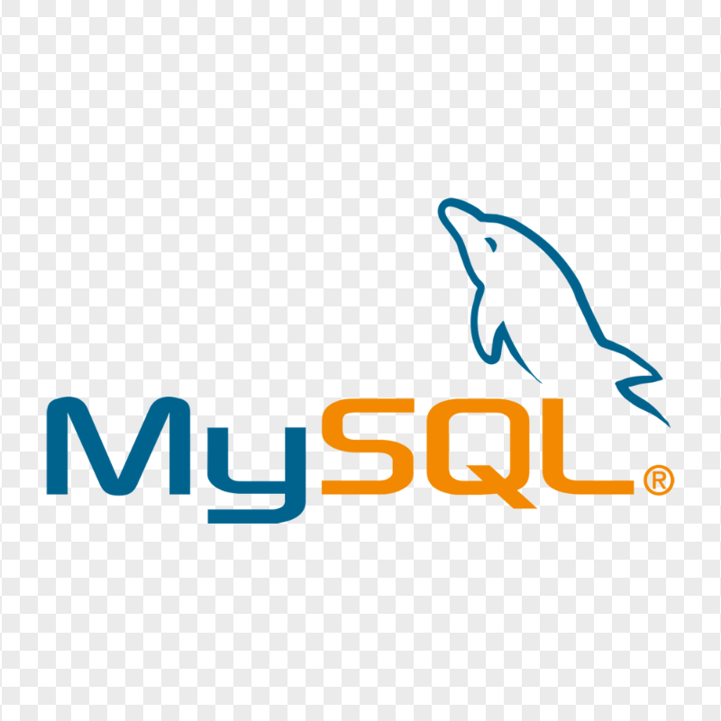
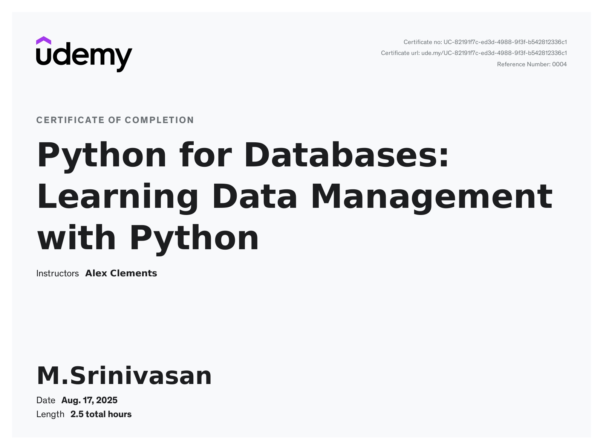
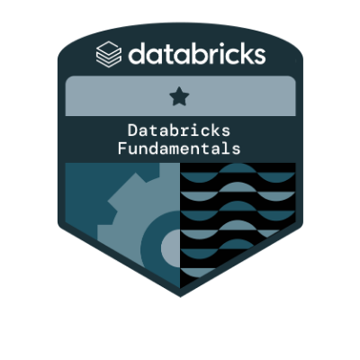
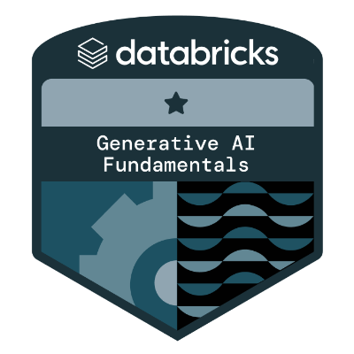
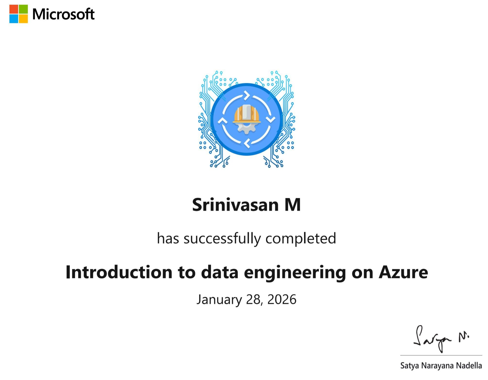
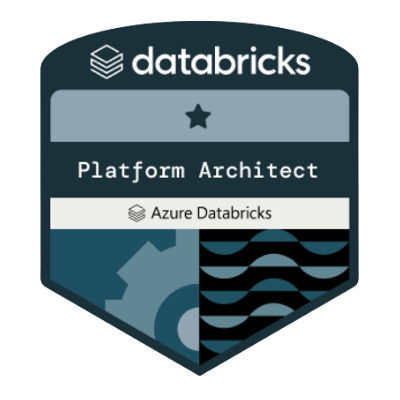

🗁 Here's my [Linkedin](https://www.linkedin.com/in/srinivasan4610/)   

Data Engineer @ Techorc Software Solutions 💼
                                       
- 🌱 I'm currently focused on building scalable data pipelines & optimizing our existing data infrastructure for reporting. 
- 🏢 Engineeing at Techorc Software 
- 🏢 Previously worked with AidasTech 
- 📸 Fun Fact >> I ❤️ photography & learning new 👨‍💻 tech

> My Work Experiences:  
- worked as a jr data engineer
- worked as a sql developer

> *Social Media Handles*  
>   
---
### I Code In :

  
  
  
  
  
  
  
  
  

### IDEs & Tools I Use :

  
  
  
  
  
  
  
  
  
  
  
  
  
  

### 💻 Workspace Spec :
   

### 🏅 Certifications & Badges

  
  
  
  
  
  
  
  

