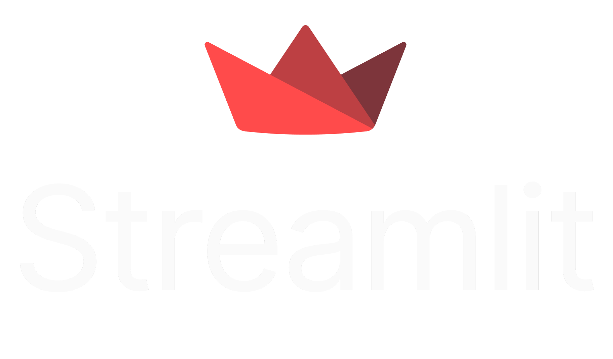

🗁 Here's my [Linkedin](https://www.linkedin.com/in/srinivasan4610/)[cite: 1]   

Data Professional & Aspiring Data Engineer 💼
                                             
- 🌱 I'm currently focused on building scalable data pipelines & optimizing our existing data infrastructure for reporting, alongside building a companion SaaS for photographers.[cite: 1]
- 🏢 Currently working as a SQL Developer at Techorc Software [cite: 1]
- 🏢 Previously worked as a Junior Data Engineer with AidasTech (Jul 2023 - Nov 2024) [cite: 1]
- 🎯 Goal >> Actively seeking a proper Data Engineer role in Bengaluru or Chennai.
- 📸 Fun Fact >> I ❤️ photography & learning new 👨‍💻 tech, with a goal of intentional living.[cite: 1]

> My Work Experiences:  [cite: 1]
- **SQL Developer** @ Techorc Software Solutions (March 2025 - Present)[cite: 1]
- **Junior Data Engineer** @ AidasTech (July 2023 - November 2024)[cite: 1]

> *Reference Files*  
> You can also check out my backup.txt file for more details.

> *Social Media Handles*  [cite: 1]
>   [cite: 1]
---
### I Code In :[cite: 1]

  
  
  
  
  
  
  
  
  

### IDEs & Tools I Use :[cite: 1]

  
  
  
  
  
  
  
  
  
  
  
  
  
  

### 💻 Workspace Spec :[cite: 1]
   

[cite: 1]

 

https://media4.giphy.com/media/v1.Y2lkPTc5MGI3NjExYTdxeHNud25haWQxa3ozOWRsaHcwc3owajR0dmR0OWdmbnFoaGR6eCZlcD12MV9pbnRlcm5hbF9naWZfYnlfaWQmY3Q9Zw/xT9C25UNTwfZuk85WP/giphy.gif[cite: 1]
